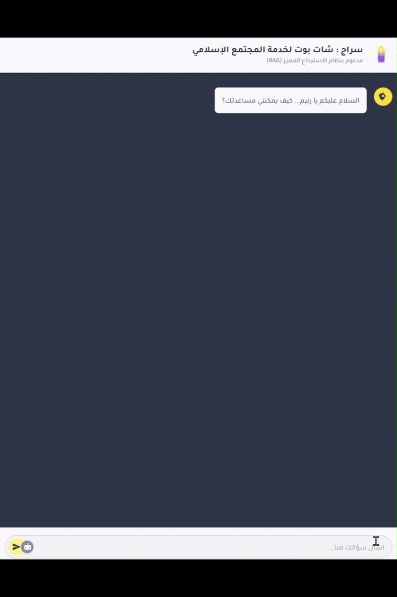
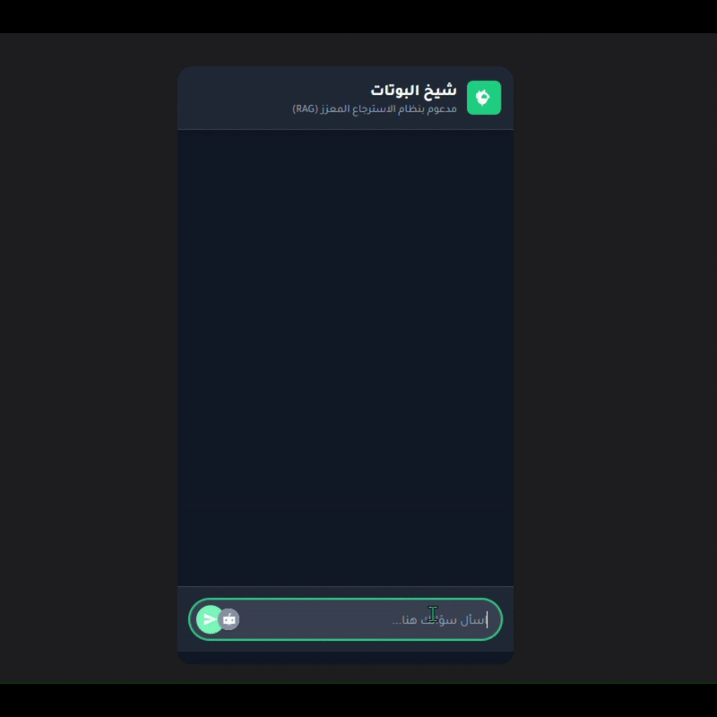

<div align="center">

# سِراج · Siraj

**An Arabic Islamic knowledge assistant that shows its working.**

Every answer arrives in three parts: the passage it rests on, the source that passage came from, and a plain-language explanation aimed at the question that was actually asked.

[](https://github.com/RaneemSadeh/Islamic-Chat-Bot/actions/workflows/ci.yml)




</div>

---

## What this is

Most Islamic chatbots answer fluently and cite nothing. Siraj is built around
the opposite constraint: **an answer that cannot show its source is a bug.**

The repository holds two programs that take that constraint seriously in two
different ways.

| | [`src/`](src/) — **web client** | [`rag_console/`](rag_console/) — **RAG console** |
|---|---|---|
| **What it does** | An Arabic, right-to-left chat interface where every reply is forced into a four-field contract: answer, passage, source, note | Real retrieval-augmented answering over PDFs you upload |
| **Stack** | React 19, TypeScript, Vite, Gemini 2.5 Flash | Streamlit, LangChain, FAISS, Nomic embeddings, Groq |
| **Grounding** | ⚠️ Model-asserted. Nothing is retrieved — citations are leads to verify | ✅ Retrieved. Answers are built from passages pulled out of your index |
| **Use it for** | The interface, the answer contract, the Arabic experience | Retrieval quality, chunking, citation accuracy |

That difference is stated plainly rather than papered over — it is the most
important thing to understand before trusting either output. The path from one
to the other is written up in [`docs/ARCHITECTURE.md`](docs/ARCHITECTURE.md).

---

## System at a glance

<div align="center">
  
</div>

More figures — indexing, query flow, the answer contract, the request sequence,
the component tree — are in [`docs/diagrams/`](docs/diagrams/) and walked
through in the architecture document. They are generated from
[`generate_diagrams.py`](docs/diagrams/generate_diagrams.py), not drawn by hand.

---

## Quick start

### The web client

```bash
git clone https://github.com/RaneemSadeh/Islamic-Chat-Bot.git
cd Islamic-Chat-Bot
npm install

cp .env.example .env.local        # then paste your key into VITE_GEMINI_API_KEY
npm run dev                       # http://localhost:3000
```

Get a key from [Google AI Studio](https://aistudio.google.com/app/apikey). With
no key the app still runs — it opens with a clear notice instead of failing at
the first question.

> **Note on the key.** Vite compiles it into the browser bundle, so it is
> readable by anyone who opens dev tools. Restrict it by HTTP referrer, and put
> it behind a server before deploying anything public.

### The RAG console

```bash
python -m venv .venv && source .venv/bin/activate   # Windows: .venv\Scripts\activate
pip install -r rag_console/requirements.txt
streamlit run rag_console/app.py
```

Then, in the sidebar: paste a [Groq](https://console.groq.com/keys) key and a
[Nomic](https://atlas.nomic.ai/) key, upload a PDF, set chunk size and overlap,
and press **بناء الفهرس** (Build index). Ask a question and the passages behind
the answer appear underneath it.

---

## How an answer is built

<div align="center">
  
</div>

The web client asks Gemini for a strict JSON object and refuses anything else:

```ts
{
  rephrasedAnswer: string;   // the explanation, in clear Arabic
  originalText:    string;   // the passage, quoted rather than paraphrased
  source: { name: string; reference: string };
  aiNote:          string;   // how the answer was produced, and its limits
}
```

A missing field or malformed JSON raises a typed error and renders as a failed
turn. A card with a blank source line would read as a citation while carrying
none — so it is never shown.

---

## Repository layout

```
.
├── src/                          # React client
│   ├── components/               # Header, ChatInput, Message, EmptyState, Feedback
│   ├── hooks/useChat.ts          # one conversation: turns, cancellation, failures
│   ├── lib/errors.ts             # typed failures mapped to Arabic copy
│   ├── services/geminiService.ts # the only module that knows a provider exists
│   ├── config.ts                 # environment in one place
│   └── types.ts                  # ChatMessage, Source, GeminiResponse
│
├── rag_console/
│   ├── app.py                    # Streamlit + LangChain retrieval console
│   └── requirements.txt
│
├── docs/
│   ├── ARCHITECTURE.md           # the long version, with every diagram
│   ├── diagrams/                 # generated SVGs + the generator
│   └── assets/                   # screen recordings
│
└── .github/workflows/ci.yml      # typecheck, build, diagram drift, py compile
```

---

## Scripts

| Command | What it does |
|---|---|
| `npm run dev` | Vite dev server on port 3000 |
| `npm run build` | Typecheck, then build to `dist/` |
| `npm run typecheck` | TypeScript in strict mode, no emit |
| `npm run diagrams` | Regenerate every SVG in `docs/diagrams/` |
| `streamlit run rag_console/app.py` | Launch the retrieval console |

---

## Limits worth knowing

- **The web client does not retrieve.** Its citations are produced by the model.
  Verify them.
- **The console's index is not persistent.** It lives in session state; a refresh
  clears it and the PDF must be re-indexed.
- **Scanned manuscripts need OCR.** `PyPDFLoader` reads a text layer; a page of
  images yields nothing to chunk.
- **Nothing here is a fatwa.** The interface says so on every screen. Questions
  that carry real consequence belong with a qualified scholar, not a language
  model.

---

## Contributing

Issues and pull requests are welcome — see
[`CONTRIBUTING.md`](CONTRIBUTING.md). The most valuable contributions right now
are a labelled Arabic retrieval evaluation set, an Arabic-first embedding
comparison, and an OCR ingestion path for manuscripts.

---

## Acknowledgements

Built on the work of the Arabic NLP community, the open-source RAG ecosystem,
and the scholars whose texts make the corpus worth searching at all.

<div align="center">
<br/>

<br/><br/>

**MIT licensed** · Built by [Raneem Sadeh](https://github.com/RaneemSadeh)

</div>
