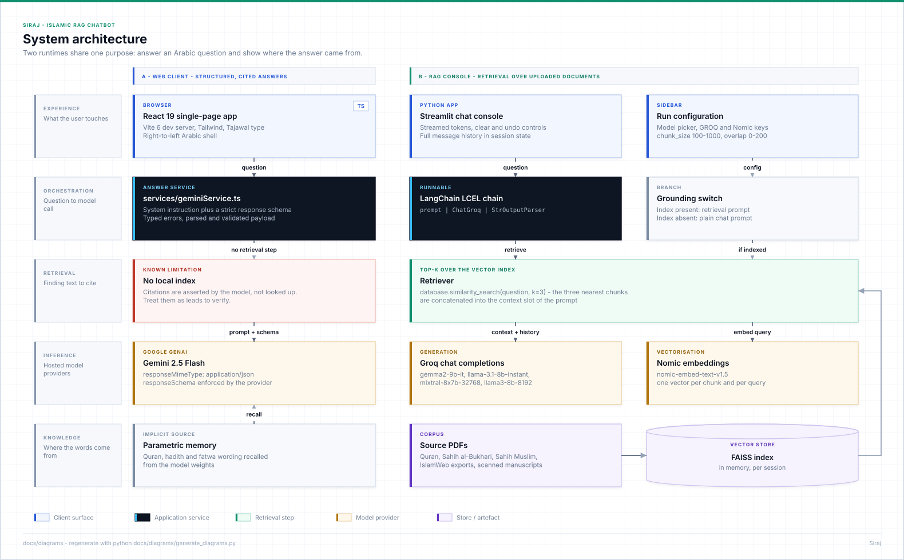
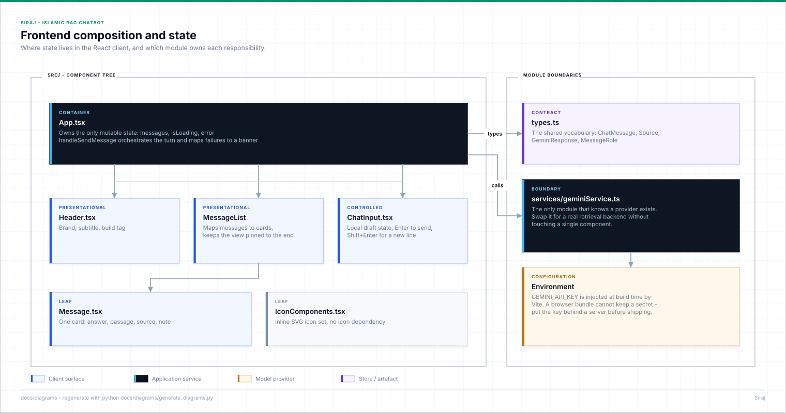
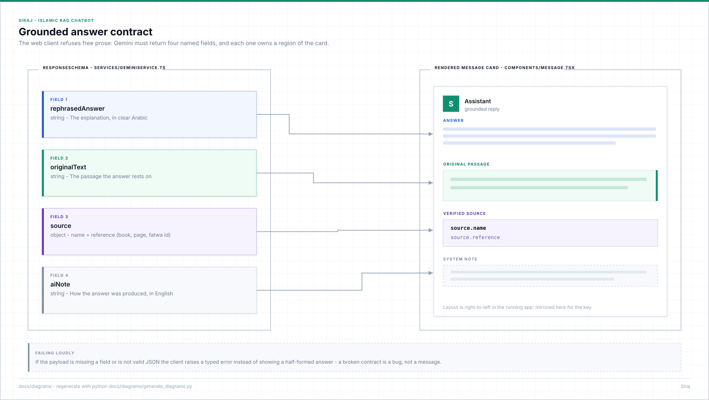
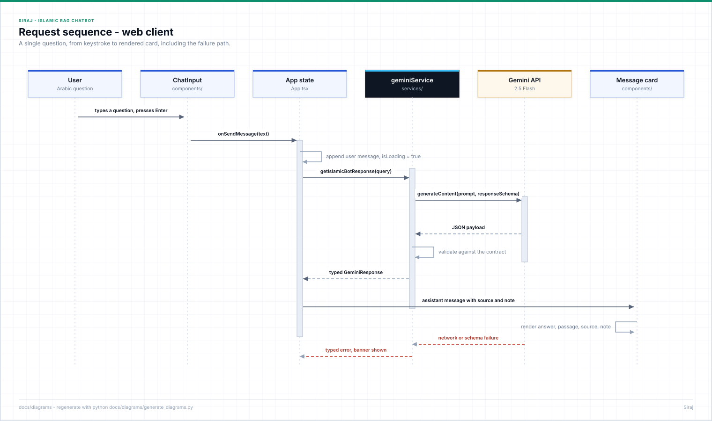
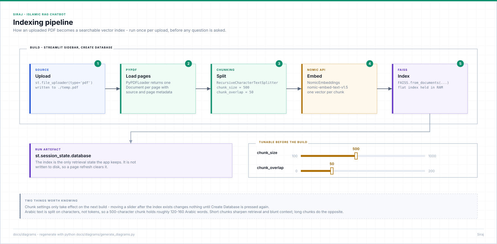
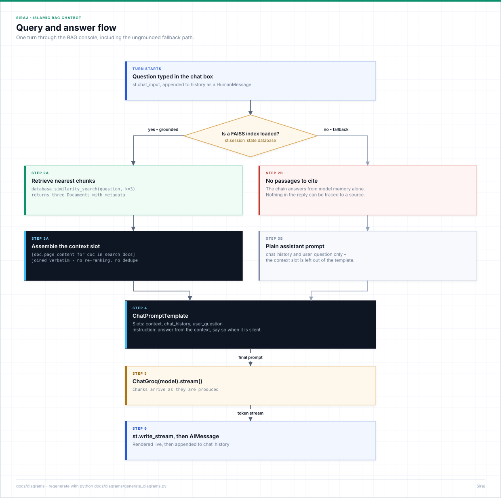

# Architecture

Siraj is two programs that answer the same kind of question in two different
ways. Keeping them in one repository is deliberate: side by side they show the
difference between an answer that *looks* sourced and an answer that *is*.

| | `src/` — web client | `rag_console/` — RAG console |
|---|---|---|
| Runtime | React 19 + Vite in the browser | Streamlit + LangChain in Python |
| Grounding | None. The model is asked to cite; nothing is retrieved. | Real. Passages come out of a FAISS index built from your PDFs. |
| Corpus | Whatever the model learned in pre-training | The documents you upload |
| Generation | Gemini 2.5 Flash with an enforced JSON schema | Groq-hosted open models, streamed |
| Good for | Interface, answer contract, RTL experience | Retrieval quality, chunking, citation accuracy |



---

## 1. The web client

### Module boundaries



`App.tsx` renders; `hooks/useChat.ts` owns the turn; `services/geminiService.ts`
is the only module that imports a provider SDK. That last boundary is the point
of the layout — swapping the simulated answer for a call to a real retrieval
backend touches one file and no component.

### The answer contract

The client does not accept free prose. The model must return four named fields,
and the interface gives each of them its own region of the card.



| Field | Why it exists |
|---|---|
| `rephrasedAnswer` | The explanation, aimed at the question that was actually asked |
| `originalText` | The passage the answer rests on, quoted rather than paraphrased |
| `source` | `name` plus `reference` — the book or site, and the position inside it |
| `aiNote` | A one-line English statement of how the answer was produced |

If any field is missing, or the payload is not valid JSON,
`parseResponse` throws a typed `SirajError` and the turn is rendered as a
failure. A half-formed answer with a blank source line would be worse than no
answer at all: it reads as a citation while carrying none.

### One turn, end to end



`useChat` appends the user message optimistically, holds an `AbortController`
so an unmounted component cannot write into dead state, maps every failure to
an Arabic message through `lib/errors.ts`, and clears the in-flight guard in a
`finally` block.

### Known limitation, stated once

The citation produced by the web client is **generated, not retrieved**. The
model is good at producing plausible references, and a plausible reference to
a hadith that does not say what the answer claims is exactly the failure mode
that matters in this domain. Every card carries an `aiNote` saying so, and the
input carries a standing notice that the output is not a fatwa.

To remove the limitation rather than disclose it, see
[Making the web client genuinely grounded](#making-the-web-client-genuinely-grounded).

---

## 2. The RAG console

### Building the index



An upload is written to a temporary file, read page by page with `PyPDFLoader`,
split by `RecursiveCharacterTextSplitter`, embedded with
`nomic-embed-text-v1.5`, and loaded into a FAISS index that lives in
`st.session_state` — in memory, for the length of the session.

Chunk size and overlap are sliders because the right values depend on the text.
Arabic is split on characters, not tokens, so a 500-character chunk is roughly
120–160 Arabic words: enough for a short hadith with its chain, not enough for
a long fatwa. Short chunks sharpen retrieval and starve context; long chunks do
the reverse. Changing a slider does nothing until the index is rebuilt.

### Answering a question



With an index loaded, the question is embedded, the three nearest chunks are
retrieved, and they are numbered and pasted into the `context` slot of the
prompt. The passages that were used are shown under the answer, so any claim
can be checked against the text it came from.

With no index loaded the chain still answers, through a different prompt that
says plainly that the reply is general and unsourced. Silently degrading from
"grounded" to "guessing" without telling the user is the thing to avoid.

---

## Configuration

| Variable | Used by | Notes |
|---|---|---|
| `VITE_GEMINI_API_KEY` | web client | Compiled into the bundle, therefore public. Restrict by referrer. |
| `GROQ_API_KEY` | RAG console | Entered in the sidebar, or exported before launching |
| `NOMIC_API_KEY` | RAG console | Needed to embed, both at index time and query time |

`vite.config.ts` also accepts the legacy `GEMINI_API_KEY` name so an existing
`.env` keeps working.

---

## Where this goes next

### Making the web client genuinely grounded

1. Stand up a small API — FastAPI or a serverless function — holding the keys.
2. Move the corpus into a persistent vector store (pgvector, Chroma, Qdrant) with
   metadata for book, chapter, and position.
3. Retrieve top-k, then have the model answer **from those passages only**, filling
   `source` from the chunk metadata instead of from the model's own memory.
4. Point `services/geminiService.ts` at that API. No component changes.

At that point the two halves of this repository become one system: the console's
retrieval behind the client's interface.

### Other work worth doing

- **Arabic-native embeddings.** `nomic-embed-text-v1.5` is multilingual, not
  Arabic-first. AraBERT or E5-multilingual are worth measuring against it on a
  labelled question set.
- **Diacritics and normalisation.** Normalising alef forms, stripping tashkeel at
  index time while keeping it for display, and handling ta marbuta would all
  raise recall.
- **A retrieval evaluation set.** Fifty questions with known correct passages turns
  chunk tuning from taste into measurement.
- **Scanned manuscripts.** OCR is the missing ingestion path; `PyPDFLoader` reads
  a text layer and returns nothing useful without one.

---

## Regenerating the diagrams

Every SVG under `docs/diagrams/` is generated:

```bash
python docs/diagrams/generate_diagrams.py
```

`_engine.py` holds the drawing primitives and the palette;
`generate_diagrams.py` holds the content of each figure. Edit the definitions,
never the SVG — CI fails the build if the committed files drift from what the
generator produces.
